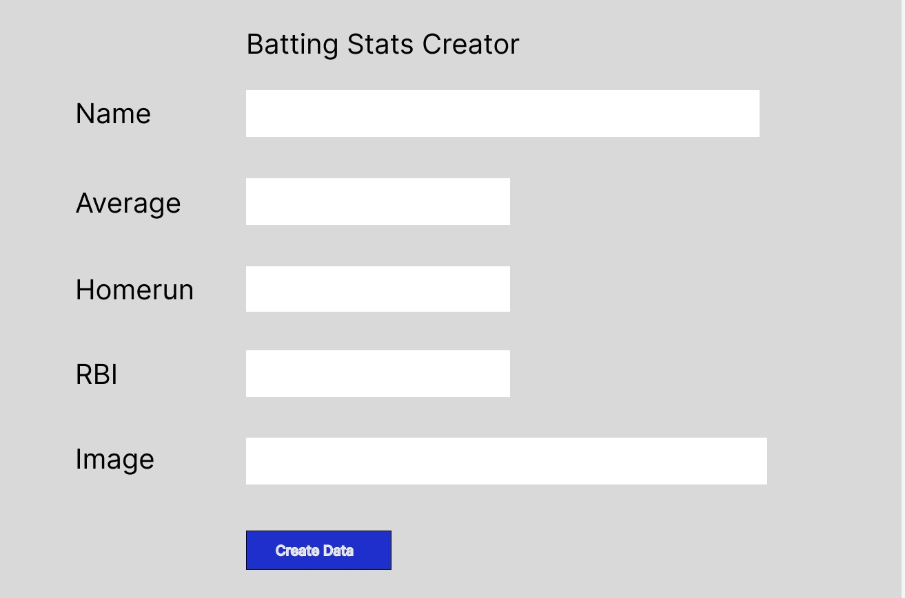
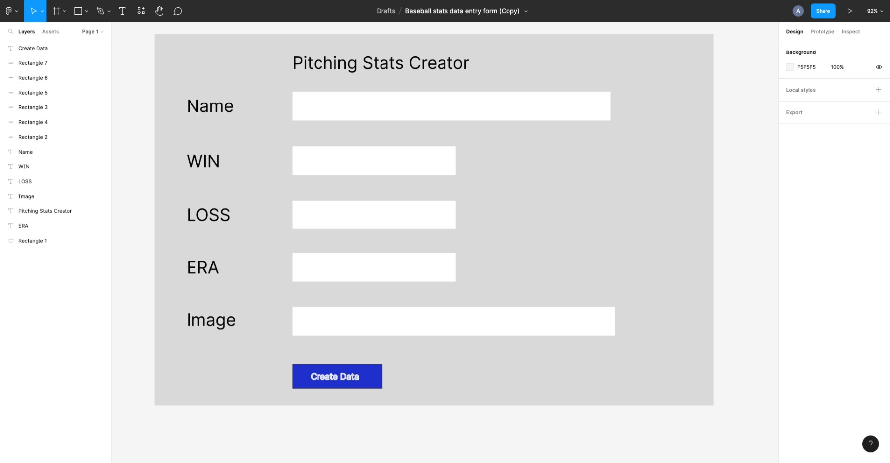
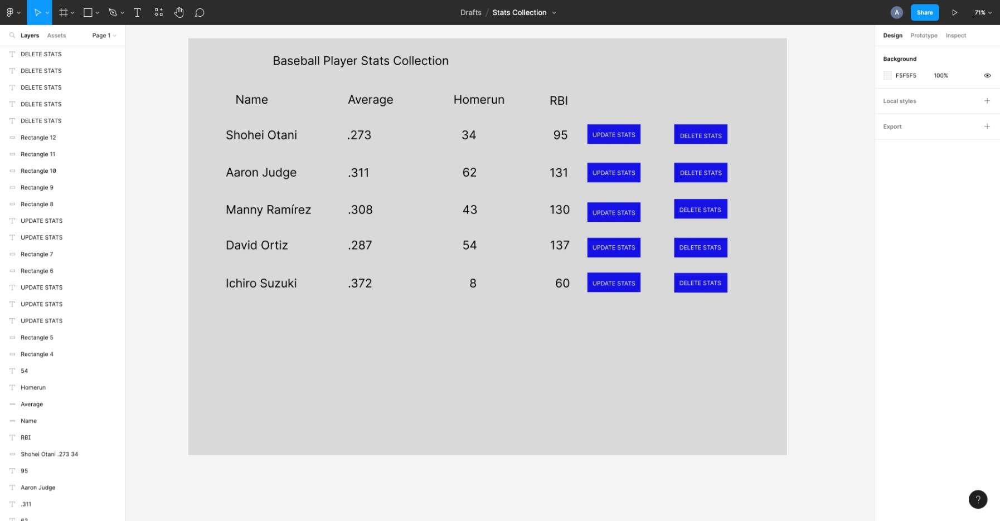
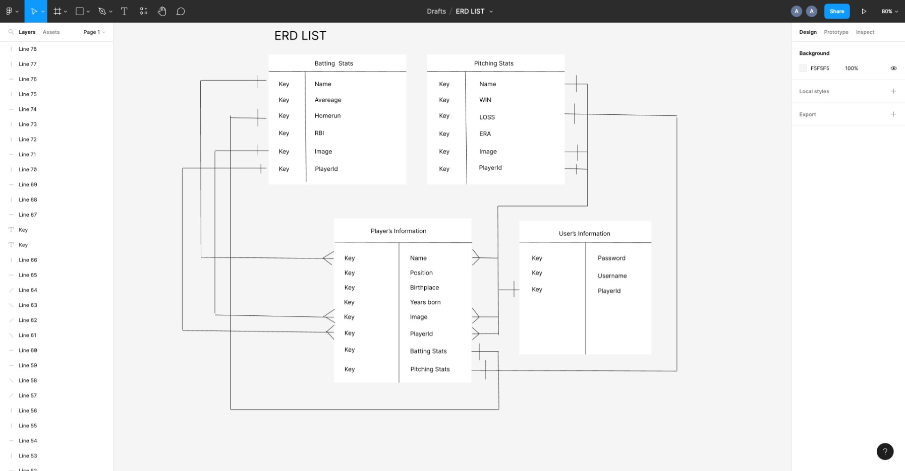

# ** TITLE **  Baseball Stats Data Collection

# Wireframe
# Batting Stats Creation Form

--
# Pitching Stats Creation Form

--
# Stats Collection Board

--
# ERD List

---

User Stories

 MVP
  1. As a user, I want a user to make the stats of baseball player, a pitcher and a batter on the stats creator form.
  2. As a user, I want to see all the data of the baseball player name and the stats on the baseball data collection screen. 
  3. As a user I want to have a user to delete and update by pushing delete or update button.
  4. As a user, I want to make a player's stats and a batter's stats as a subdocument. 

  Version 2
  1. As a user, I want to upload he image of player in addition to the name and stats.
  2. As a user, I want to make a certain people who has a correct username and password to go to the stats collection board because I do not want user whom I do not know modify data. 

